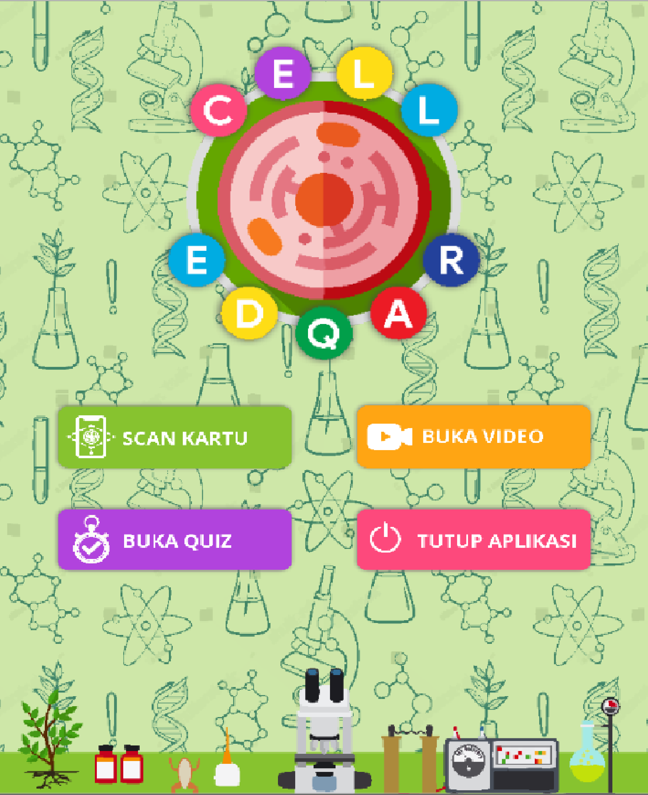

Cell-EDQAR
==========

Cell-EDQAR is my secon Augmented Reality Project. This project is a collaboration between me from Faculty of Engineering and my colleagues from Faculty of Mathematics and Natural Sciences. Thanks to this app, my team was able to be the winner of AISEF 2020 (gold medal). This activity is an international competency from elementary to university level in ASEAN with a total of 165 teams from Indonesia, Vietnam, Cambodia, Thailand, the Philippines, Malaysia, and others. I developed this app using Unity 3D as the engine and C# as the main programming language.

App Screenshots 
---------------
* App preview:  
  

* Main Features:  
 

Assets Copyright
----------------

this app is using some licensed 3D model and private video. Replace those assets with your own.
